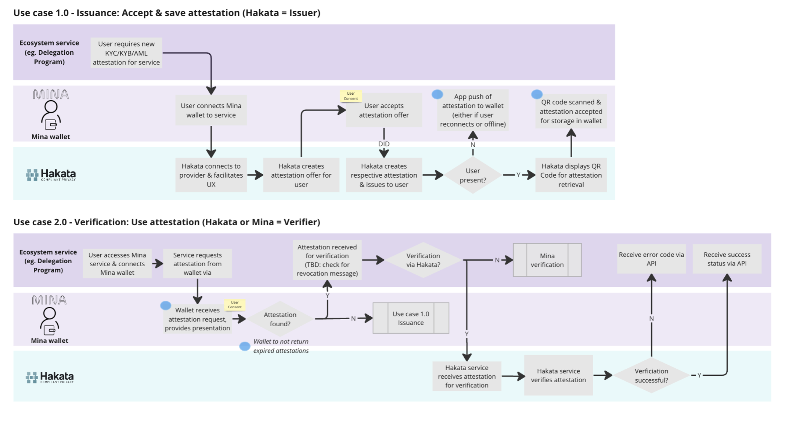

# RFC-0009: Wallet Provider Private Attestation API

## Abstract

This proposal introduces an extension to the wallet provider API for Mina wallets similar to EIP-1193, focusing on enabling attestations beyond the current features of attesting to knowledge of private keys through RPC methods like sign. Mina's zk-native nature and client-side proving features see the ecosystem well suited to attest to knowledge of many types of private data beyond knowledge of private keys. This proposal aims to expand this feature, allowing wallets to attest to a broader range of private data, such as credentials and zkOracle proofs. The concept of composable privacy is central to this extension, offering users and developers the discretion to select which data remains private and which becomes public. This ensures that sensitive data is not exposed to the browser context, remaining in the wallet, thereby upholding the privacy and security of users' private information. By empowering wallets to attest to private data within their contexts, this proposal brings to life a crucial aspect of composable privacy in the Mina ecosystem.

Additionally, this proposal should enable users to collaborate with a 3rd party such as a KYC provider to generate a proof that includes data not available locally.

## Motivation

The motivation behind extending the Mina wallet provider API stems from the evolving needs of the Mina ecosystem's zkApp landscape. Currently, there exists no standard for Mina wallets to interact with zkApps and attest to known private data. This limitation hinders the full potential of Mina's composable privacy feature, which is vital for user autonomy and data security.

## Understanding Attestations

Attestations are “claims” which can be verified and used across any platform. The idea is that a user can generate a claim regarding some private information of any complexity and share this claim with 3rd parties who can be confident that the claim is correct.

### Attestations Have Two Components:

**Claim:** A statement, for example, “I have 20 eth in my wallet” or “I’m above the age of 24”.

**A Cryptographic Artifact:** Any proof, be it a Merkel proof or ZK proof, which can be independently used to verify the claim.

### Types of Attestations

**Permissioned Attestations**

Some attestations must be generated using 3rd party data sources; thus, a 3rd party will need to generate these attestations. The resulting proof can then be sent over to a user's wallet and used to “compose” a final proof.

An example would be a 3rd party KYC provider generates a proof that “this ID is not on a sanctions list”.

**Local Attestations**

Local attestations are generated from private data a user can access on his local device. A local attestation may also be generated based on proofs provided from permissioned attestations.

An example would be a proof that “I hold 20 NFTs of type X” and “My ID is not on a sanction list”. The proof regarding the NFTs could be generated locally while the ID proof would have been generated remotely and finally both would be combined.

### Who Will Be Producing Attestations?

3rd party platforms must generate permission attestations and users may generate local attestations.

We will go more in-depth on this topic later on.

### Who Will Be Consuming Attestations?

Any platform interested in verifying a proof may consume attestations.

### Can We Compose Attestations?

Yes, attestations can be composed. A user may generate many “base” attestations from 3rd parties and then combine them into a final attestation to be consumed by a verifier.

We will define this more clearly in the protocol.

## Specification

### Requirements

- Standardized attestation construction API (user should be able to attest to any data)
- Attestation composition API (user should be able to compose local and remote proofs)
- Nullifier and expiration support for proofs
- Secure proof storage

### API

Wallets should have a provider API parallel to EIP-1193 but tailored for Mina. The goal of this API extension is to build on top of pre-existing standards.

### Wallet Provider Attestation Lifecycle



- An app requests the user to provide proof of KYC
- User connects their wallet to a 3rd party KYC provider
- 3rd party KYC provider requests proof of passport ownership
- User scans their passport with NFC and generates a local proof of ownership
- 3rd party KYC provider then verifies the proof and generates a proof of KYC, proving the user isn't on any sanction or blacklist. The 3rd party KYC provider then sends that proof to the user.
- User then composes a proof of both proofs into a single proof.
- User sends attestation proof to the Service and is allowed to access the app.

## Wallet Provider Attestation API

**Example: Proving Age Greater Than a Given Value**

Below is an example of how the Attestation API would be used to attest to a user's age.

The flow begins by defining a ZK program using `credentialProgram.create` this definition instructs our mini DSL on how to generate a proof according to specific primitive constraints.

A `claim` is then constructed, a `claim` is private data which the user wants to attest to. This `claim` can be turned into a `Credential` which could even be used later to attest to the data in the `claim`.

The `Credential` can then be used to generate a proof based on public params such as minAge in this specific example and the `credentialProgram` generated earlier.
```javascript
import { Credential } from '@custom-sdk/credentials';
import credentialProgram from '@custom-sdk/credentialProgram';
import { Operations } from '@custom-sdk/credentialProgram';
import { PrivateKey, PublicKey } from '@custom-sdk';

// Define the VerifyComplexAge program using modular operations from the library
const VerifyComplexAgeProgramConfig = {
    name: 'VerifyComplexAge',
    input: { minAge: 'number', maxAge: 'number' },
    output: { valid: 'boolean' },
    logic: Operations.and([
        Operations.greaterThanOrEqual('credential.age', 'input.minAge'),
        Operations.lessThanOrEqual('credential.age', 'input.maxAge')
    ])
};

// Create the VerifyComplexAge program instance
const VerifyComplexAge = credentialProgram.create(VerifyComplexAgeProgramConfig);

// Generate issuer private and public keys
const issuerPrvKey = PrivateKey.random();
const issuerPubKey = issuerPrvKey.toPublicKey().toBase58(); // Convert to string format for use in the challenge

// Generate subject private and public keys
const subjectPrvKey = PrivateKey.random();
const subjectPubKey = subjectPrvKey.toPublicKey().toBase58(); // Convert to string format for use in the challenge

// Construct a claim about the subject, including a signature by the issuer
const claimsObject = { age: 21, subject: subjectPubKey, signature: issuerPrvKey.sign('age:21') };
const claims = JSON.stringify(claimsObject);

// Construct a credential using the claim
const credential = Credential.create(claims);

// Prove the credential satisfies the challenge using the VerifyComplexAge program
const proofResponse = await credential.prove('age', { minAge: 18, maxAge: 65, issuerPublicKey: issuerPubKey }, VerifyComplexAge);

console.log(proofResponse);
```

The `Issuer Key` ensures the credential is authentic and signed by a trusted issuer, while the `Subject Key` ensures that only the legitimate owner of the credential can generate proofs, maintaining confidentiality and data integrity.

## Wallet Provider Attestation API Definition

The API should be initialized within the wallet provider context. It could use an initialization function to set up necessary configurations.

```javascript
interface MinaWallet {
    attestation: AttestationAPI;
}

interface AttestationAPI {
    initialize(config: AttestationConfig): Promise<void>;
}

interface AttestationConfig {
    apiKey: string;
    endpoint: string;
}
```

### Credential Creation API

This API allows users to create credentials about various data types locally.

```javascript
interface AttestationAPI {
    create(params: LocalCredentialParams): Promise<CredentialResponse>;
}

interface LocalCredentialParams {
    claims: { [key: string]: any }; // Claims about the subject
}

interface CredentialResponse {
    credentialId: string;
    credential: string; // Encoded credential
    nullifier?: string; // Unique identifier for the credential
    nullifierKey?: string; // Key associated with the nullifier
    nullifierProof?: string; // Proof that the nullifierKey was derived as expected
    expiration?: number; // Expiration time if set
}
```

### `credentialProgram.create` API

This API is used to define a Zero-Knowledge (ZK) program that specifies the logic for generating cryptographic proofs.

```javascript
interface CredentialProgramInput {
    [key: string]: 'number' | 'string' | 'boolean';
}

interface CredentialProgramOutput {
    [key: string]: 'boolean';
}

interface CredentialProgramConfig {
    name: string;
    input: CredentialProgramInput;
    output: CredentialProgramOutput;
    logic: OperationNode; // Updated to use a static object
}

interface OperationNode {
    operation: string;
    inputs?: (OperationNode | any)[]; // The inputs can be either another operation node or a static value
    [key: string]: any; // Allow for additional properties specific to the operation
}

interface CredentialProgram {
    create(config: CredentialProgramConfig): CredentialVerificationInstance;
}

interface CredentialVerificationInstance {
    name: string;
    input: CredentialProgramInput;
    output: CredentialProgramOutput;
    logic: OperationNode;
}
```

When generating a new ZK Program,

 the `create` must know how to parse the `CredentialVerificationInstance` logic and generate input compatible with our custom DSL (see below custom DSL definition).

### `credentialProgram.Operations` API

Every credential program receives an `OperationNode`, an operation node is an object which defines the boolean operations required to arrive at the final attestation state, for example:

```json
{
    "operation": "and",
    "inputs": [ 
                {
                    "operation": "greaterThan",
                    "firstInput": 18,
                    "secondInput": "credential.age",
                },
                {
                    "operation": "lessThan",
                    "firstInput": 51, 
                    "secondInput": "credential.maxAge",
                },
                ...
          ]
}
```

However, writing such a verbose expression is complex, hard to debug, and prone to errors. Thus, we define an operations library which can generate these structures while making it easy for users to define the logic they desire. Let's define a reference implementation:

```javascript
// Define boolean operations
const Operations = {
    greaterThanOrEqual: (firstInput, secondInput) => ({
        operation: 'greaterThanOrEqual',
        firstInput,
        secondInput
    }),
    lessThanOrEqual: (firstInput, secondInput) => ({
        operation: 'lessThanOrEqual',
        firstInput,
        secondInput
    }),
    and: (inputs) => ({
        operation: 'and',
        inputs
    }),
    or: (inputs) => ({
        operation: 'or',
        inputs
    }),
    equals: (firstInput, secondInput) => ({
        operation: 'equals',
        firstInput,
        secondInput
    }),
    hash: (input) => ({
        operation: 'hash',
        input
    }),
    verifySignature: (message, signature, publicKey) => ({
        operation: 'verifySignature',
        message,
        signature,
        publicKey
    }),
    verifyProof: (inputs) => ({
        operation: 'verifyProof',
        inputs
    })
    // Add more operations as needed
};

export default Operations;
```

Users can now use these methods to compose complex logic.

```javascript
const operationsJSON = Operations.and([
        Operations.greaterThanOrEqual('credential.age', 18),
        Operations.lessThanOrEqual('credential.age', 65),
        Operations.verifySignature('credential.message', 'credential.signature', 'credential.publicKey')
])
```

### `Credential.create` API

This API is used to create a credential from a set of claims.

```javascript
interface CredentialAPI {
    create(claims: string): Credential;
}

interface Credential {
    claims: { [key: string]: any };
    issuerPublicKey: string;
    signature: string;
}
```

### `Credential.prove` API

This API is used to generate a cryptographic proof based on a credential, a set of public parameters, and a ZK program.

```javascript
interface ProofAPI {
    prove(claimKey: string, publicParams: object, credentialVerificationInstance: CredentialVerificationInstance): Promise<ProofResponse>;
}

interface ProofResponse {
    proof: object;
    proofId: string;
    valid: boolean;
    publicParams: object;
}

interface CredentialVerificationInstance {
    name: string;
    input: { [key: string]: 'number' | 'string' | 'boolean' };
    output: { [key: string]: 'number' | 'string' | 'boolean' };
    logic: (input: { [key: string]: any }) => { [key: string]: any };
}
```

### Proof Composition API

This API allows users to compose multiple proofs into a composite proof.

```javascript
interface AttestationAPI {
    composeAttestation(params: ComposeParams): Promise<ComposeResponse>;
}

interface ComposeParams {
    attestationIds: string[]; // List of attestation IDs to be composed
}

interface ComposeResponse {
    compositeAttestationId: string;
    compositeProof: string; // Composite cryptographic proof
}
```

### Nullifier Implementation for Preventing Double Use of Proofs

Nullifiers are a critical component in Zero-Knowledge Proof systems, ensuring that proofs cannot be reused, thereby preventing replay attacks. The implementation of nullifiers in the proposed Wallet Provider Attestation API will enhance the security and privacy of attestations by ensuring that each proof is unique and can only be used once. This section will delve into how nullifiers can be effectively integrated into the API to achieve this goal.

#### What is a Nullifier?

A nullifier is a cryptographic element used to mark a proof as consumed. Once a proof is used, its nullifier is recorded to prevent the same proof from being used again. This mechanism is crucial for maintaining the integrity and trustworthiness of the ZKP system, as it ensures that the proofs cannot be replayed or duplicated.

#### Implementation Strategy

The nullifier implementation involves generating a unique identifier for each proof, which will be stored and checked during verification. Here’s a detailed approach to implementing nullifiers within the Wallet Provider Private Attestation API:

1. **Nullifier Generation**:
   - During proof generation, a nullifier will be created using a deterministic function based on the credential’s unique identifier and claims. This ensures that the nullifier is unique to each proof.
   - The nullifier should be coupled with a `nullifierKey`, which is generated by hashing the nullifier with a zkApp-specific hash and an auto-generated salt. This ensures that the nullifierKey is specific to the application.
   - The salt will be auto-generated for each proof to ensure uniqueness and enhance security.
   - A proof should also be generated to show that the `nullifierKey` was derived as expected.
   - The nullifier can be generated using a ZK-friendly hash function, such as MiMCSponge, which takes the credential’s unique identifier, claims, zkApp-specific hash, and the salt as input and outputs a unique hash value.
   - The wallet should warn users if a nullifier key is being requested with the same zkApp-specific hash, as this could link different user activities.

2. **Nullifier Storage**:
   - Once a proof is used, its nullifier is recorded in a secure storage system. This storage can be on-chain or off-chain, depending on the application requirements and security considerations.
   - The storage system must ensure that nullifiers are immutable and tamper-proof.

3. **Verification Process**:
   - During the verification of a proof, the nullifier, the nullifierKey, and the salt are checked against the recorded nullifiers to ensure they have not been used before.
   - If the nullifier is found in the storage, the proof is rejected to prevent reuse.
   - This verification step ensures that each proof remains unique and prevents replay attacks.

   ```javascript
   interface VerifyParams {
       proofId: string;
       verificationKey: string; // Verification key
       nullifier: string; // Nullifier to be checked
       nullifierKey: string; // Key associated with the nullifier
       salt: string; // Salt used during proof generation
       credentialId: string; // Unique identifier for the credential
       claims: any; // Claims used to generate the nullifier
   }

   interface VerifyResponse {
       valid: boolean;
       message: string;
   }

   async function verifyProof(params: VerifyParams): Promise<VerifyResponse> {
       // Reconstruct the nullifier using the credentialId and claims
       const expectedNullifier = generateNullifier(params.credentialId, params.claims);
       if (expectedNullifier !== params.nullifier) {
           return { valid: false, message: "Invalid nullifier." };
       }

       // Verify that the nullifier and nullifierKey were derived using the salt
       const expectedNullifierKey = generateNullifierKey(expectedNullifier, params.salt);
       if (expectedNullifierKey !== params.nullifierKey) {
           return { valid: false, message: "Invalid nullifier key." };
       }

       const nullifierExists = await checkNullifier(params.nullifier, params.nullifierKey);
       if (nullifierExists) {
           return { valid: false, message: "Proof has already been used." };
       }

       // Additional verification logic here
       return { valid: true, message: "Proof is valid." };
   }

   async function checkNullifier(nullifier: string, nullifierKey: string): Promise<boolean> {
       // Check the storage for the nullifier and nullifierKey
       // Return true if nullifier exists, false otherwise
   }

   function generateNullifierKey(nullifier: string, salt: string): string {
       // Generate the nullifierKey using the nullifier and salt
       // This is a placeholder implementation and should use a secure hash function
       return someHashFunction(nullifier + salt);
   }

   function generateNullifier(credentialId: string, claims: any): string {
       // Generate the nullifier using a secure hash function
       return someHashFunction(credentialId + JSON.stringify(claims));
   }

   function generateSalt(): string {
       return randomBytes(16).toString('hex'); // Generate a 16-byte salt and convert to hex
   }
   ```

4. **Client-Side Nullifier Generation**:
   - To further enhance privacy, nullifiers should be generated on the client-side. This approach ensures that the server or any third party does not have access to the inputs used for nullifier generation.
   - Client-side generation also aligns with the principle of minimizing trust in external entities, thus enhancing the overall security model.
   - The wallet should auto-generate the salt, use it to generate the nullifierKey by hashing the "raw" credential hash with the zkApp-specific hash and the salt, and warn the user if the same zkApp-specific hash is being reused

# DSL

In order to avoid the distribution of many ZK programs we think it would be beneficial to implement a DSL as a ZK circuit. As input this DSL would receive a list of commands compiled from the `CredentialProgramConfig`.

Let's outline the steps and components needed to implement a predefined circuit with a command interpreter for the ZK program.

### Steps to Implement the Predefined Circuit with Command Interpreter

1. **Define the Command Language**: Create a simple command language to represent the logic, inputs, and outputs.
2. **Implement the Command Interpreter**: Write the logic to parse and execute the commands within the circuit.
3. **Integrate the Interpreter into the Circuit**: Ensure the circuit can handle the input commands, execute them, and produce the correct outputs.

### Command Language Definition

The command language needs to be simple yet expressive enough to handle typical logical operations and data manipulations.

#### Command Language Syntax

1. **Set Input**: Assign values to input variables.
    ```plaintext
    SET INPUT variable value;
    ```
2. **Set Output**: Assign values to output variables.
    ```plaintext
    SET OUTPUT variable value;
    ```
3. **Conditional Statements**: Perform conditional logic.
    ```plaintext
    IF variable1 operator variable2 THEN
        commands
    ELSE
        commands
    ENDIF;
    ```
    - **Operators**: `==`, `!=`, `<`, `>`, `<=`, `>=`

### Example Program in Command Language

Here is the `VerifyAge` program defined via our Attestation API:

```javascript
// Define the VerifyAge program
const VerifyAge = credentialProgram.create({
    name: 'VerifyAge',
    input: { age: 'number', minAge: 'number' },
    output: { valid: 'boolean' },
    logic: (input) => {
        return { valid: input.age >= input.minAge };
    }
});
```

```javascript
const claimsObject = { age: 21, subject: subjectPubKey, signature: issuerPrvKey.sign('age:21') };
const claims = JSON.stringify(claimsObject);
const credential = Credential.create(claims);
const proofResponse = await credential.prove('age', { minAge: 18, issuerPublicKey: issuerPubKey }, VerifyAge);
```

Here is the `VerifyAge` program outputted in the command language, the command language is compiled at the Attestation API level:

```plaintext
SET INPUT age 21;
SET INPUT minAge 18;
IF age >= minAge THEN
    SET OUTPUT valid true;
ELSE
    SET OUTPUT valid false;
ENDIF;
```

The SET INPUT commands are extracted from the Credential and prove commands as the private and public inputs.

#### Example Usage

```javascript
const commandString = `
SET INPUT age 21;
SET INPUT minAge 18;
IF age >= minAge THEN
    SET OUTPUT valid true;
ELSE
    SET OUTPUT valid false;
ENDIF;
`;

const interpreter = new CommandInterpreter();
const commands = interpreter.parse(commandString);

console.log(interpreter.outputs); // { valid: true }
```

`CommandInterpreter` is wrapping a ZK circuit implemented in O1JS.

### Summary

1. **Define Command Language**: Simple commands to set inputs, outputs, and perform logic.
2. **Implement Interpreter**: Parse and execute commands to manipulate inputs and outputs.
3. **Integrate into ZK Circuit**: Use the interpreter within the ZK circuit to handle command strings and produce the correct outputs.

This approach leverages a predefined circuit with a command interpreter, making it easier to handle various logic scenarios dynamically while maintaining simplicity and consistency.