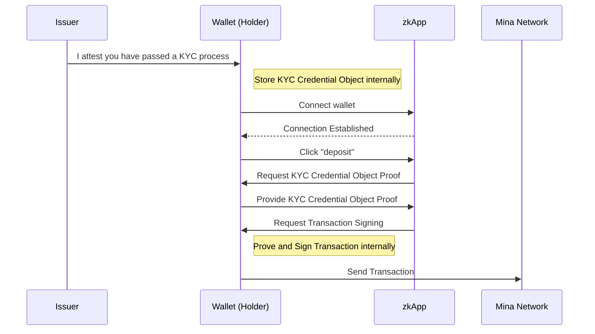

# RFC-0009: Wallet-zkApp Interaction - Storing & Requesting Objects

- **Intent**: Introduces an extension to the wallet provider API for storing and requesting objects like proofs and credentials.
- **Submitted by**: Theodore Pender (Github: @teddyjfpender, email: theodore.pender@minaprotocol.com, Twitter/X: @franklyteddy)
- **Submitted on**: Monday, January 15, 2024

## Abstract

This proposal details a mechanism for enhancing the interaction between zero-knowledge applications (zkApps) and wallets in the Mina ecosystem. The main objective is to allow wallets to use and store data objects that can be used when interacting with zkApps. Storing data objects provided to the wallet by zkApps and providing data objects to zkApps that are stored or created in the wallet is necessary given Mina’s ability to perform client-side proving as well as Mina's zkApps requiring provable arguments in both contract and provable program methods. It is important to note that the specification outlined in this document represents one variation of data sharing that is not censorship resistant, and does not ensure availability guarantees from the provider.

## Motivation

A robust integration between wallets and zkApps is essential for Mina's evolving ecosystem. It is necessary to create standards that capitalize on Mina's unique features such as client-side proving and recursive proving thereby potentially simplifying the experience for numerous protocol users. This is especially important when zkApps require arguments to either smart contracts or provable programs that do not exist on-chain nor are queryable, examples include interacting with applications that require proof objects from prior interactions, as well as applications that require verifiable credential proofs as arguments to smart contracts and provable programs. Extending the wallet Mina provider API for facilitating interactions with zkApps that have these or similar requirements can improve interaction between wallets and zkApps as well as allow zkApp developers to explore new idea-spaces for zkApp design and implementation.

## Specification
In the Web3 application ecosystem, which includes decentralized applications (dapps) and zero-knowledge applications (zkApps), it's a norm for key management software, known as "wallets," to make their API accessible through a JavaScript object in a web page—often termed "the Provider."

However, inconsistencies have arisen in Provider implementations across wallets. This proposal seeks to standardize a Mina Provider API to ensure continued wallet interoperability with zkApps. This specification assumes wallets already implement the minimal, event-driven APIs equivalent to EIP-1193 for Mina; this specification introduces new RPC methods and message event types.

Although Providers have historically been presented as `window.mina` in browsers, this convention isn't mandated in the specification.

### API
Wallets should have a provider API parallel to EIP-1193 but tailored for Mina. The goal of this API extension is to build on top of pre-existing standards. 

#### Key Features of the Proposed API

- **Agnosticity to Application Types**: Whether an application operates on-chain, off-chain, or a combination of the two, this API remains consistent and reliable. 

- **Explicit User Control**: In a Mina-enabled DOM environment, the user is always in the driver's seat. The protocol is designed such that:

    - **User Consent for Object Access**: Before a zkApp can access any object, explicit user approval is mandatory. 
    - **User Consent for Storing Objects**: Just as access is restricted, storage of any objects by the wallet requires the user's green light. It ensures that users are aware of what's being stored in their wallets, enhancing transparency.

#### Primary Functionalities:
The proposed API should empower a Mina wallet to:
- **Receive Objects**: Accept and store objects, whether they're verifiable credentials, proofs, or any other data.
- **Request Objects**: Initiate requests to retrieve stored objects, facilitating interactions like transaction validations or data computations.

### Scenario: A Wallet Receiving Objects to Store
#### `mina_setState`
Providers within Mina's domain could introduce a new RPC method: `mina_setState`. When called, a user interface might emerge, allowing users to choose whether to store objects from a zkApp. This method returns a Promise: resolving with a boolean or, if storing is unavailable, rejecting with an Error. A zkApp MUST provide sufficient information in the request to allow the wallet to store and index the object appropriately.

zkApps may need to store objects in a wallet, such as verifiable credentials or proofs, which are critical for subsequent interactions. To facilitate this, the wallet requires a new provider method with specific parameters:

```
// Pseudocode
START zkApp
IF provider is defined
    REQUEST[1] object storage
    IF user approves
        RESOLVE[2] object stored
        CONTINUE zkPP
    IF user rejects
        REJECT[3] object storage
        STOP zkApp
IF provider is undefined
    STOP zkApp
```
[1] `REQUEST`
zkApp MUST request object storage by calling the `mina_setState` RPC method on the provider exposed at `window.mina`. Calling this method MUST emit an event `message` that signifies the zkApp's initiation of the process to request the wallet to store an object and MAY trigger a user interface that allows the user to approve or reject object storage for a given zkApp. This method MUST return a Promise that is resolved with a boolean or rejected if no storage is available (e.g., the user rejected object storage).

 [2] `RESOLVE`
The Promise returned when calling the `mina_setState` RPC method MUST be resolved with a boolean. This must emit an event `message` indicating that the request to store the object has been approved and the promise has been resolved with a boolean.

 [3] `REJECT`
The Promise returned when calling the `mina_setState` RPC method MUST be rejected with an informative Error if no storage is available for any reason. This must emit an event `message` indicating that the request to store the object has been rejected, and the promise is rejected with an error.

A wallet MUST adequately detail to the user what the zkApp is requesting the wallet to store. If approved the wallet MUST appropriately store the object for future use. The zkApp COULD provide in the params appropriate information for how this object is indexed if the zkApp will require the information later.

#### Example initialization - Request objects to be stored in the wallet

```ts
import { Mina, Proof } from "o1js";

const mina = window.mina;

try {
    // The object to store
    const storableObject = “{ 
                    "@context": [
                        "https://www.w3.org/2018/credentials/v1",
                        ],
                    "id": "http://example.edu/credentials/1872",
                    "type": ["VerifiableCredential"],
                    "issuer": "https://example.edu/issuers/565049",
                    "issuanceDate": "2010-01-01T19:23:24Z",
                    "credentialSubject": {
                        "id": "did:example:ebfeb1f712ebc6f1c276e12ec21",
                        "alumniOf": {
                        "id": "did:example:c276e12ec21ebfeb1f712ebc6f1",
                        "name": [{
                            "value": "Example University",
                            "lang": "en"
                        }, {
                            "value": "Exemple d'Université",
                            "lang": "fr"
                        }]
                        }
                    },
                    "proof": {
                        "publicInput": [/* public inputs */],
                        "publicOutput": [/* public outputs */],
                        "maxProofsVerified": 0,
                        "proof": "KCh...Skp"
                        }
                    }”
    // Request object stored by wallet
    const stored = await mina.request({method: 'mina_setState', params: {object: storableObject}});
} catch (error) {
    // User denied storage access
}
```

### Scenario: Requesting Known Objects From a Wallet
#### `mina_getState`
Providers in Mina-aware DOM settings should also offer `mina_getState`, an RPC method. This method might present a user interface, letting users grant or deny object access for zkApps. The method returns a Promise, either resolving with an Array of objects or, if unavailable, rejecting with an Error.

zkApps may require objects from a wallet (e.g. verifiable credentials, proofs), these objects may be relevant for interactions. To be able to provide the required objects, the wallet requires a new provider method with certain params. This should follow a regular pattern: 

```
// Pseudocode
START zkApp
IF provider is defined
    REQUEST[1] object access
    IF user approves
        RESOLVE[2] object access
        CONTINUE zkPP
    IF user rejects
        REJECT[3] object access
        STOP zkApp
IF provider is undefined
    STOP zkApp
```

[1] `REQUEST`
zkApp MUST request objects by calling the `mina_getState` RPC method on the provider exposed at `window.mina`.  Calling this method MUST emit an event `message` that signifies the zkApp's initiation of the process to request access to objects from the wallet and MAY trigger a user interface that allows the user to approve or reject object access for a given zkApp. This method MUST return a Promise that is resolved with an array of one or more user objects or rejected if no accounts are available (e.g., the user rejected object access).

 [2] `RESOLVE`
The Promise returned when calling the `mina_getState` RPC method MUST be resolved with an Array of user objects. This must emit an event `message` indicating that the request to access objects has been approved, and the promise has been resolved with an array of user objects.

 [3] `REJECT`
The Promise returned when calling the `mina_getState` RPC method MUST be rejected with an informative Error if no objects are available for any reason. This must emit an event `message` indicating that the request to access objects has been denied, and the promise is rejected with an error.

#### Example initialization - request credentials by a specific issuer

```ts
import { Mina, Proof } from "o1js";

const mina = window.mina;

try {
    // Request object access if needed
    const objects = await mina.request({method: 'mina_getState', params: { issuer: "Example-KYC-Issuer", region: "EU" } });
    // objects are now exposed, format objects as desired
    const credentialKYC = KYCProof.fromJSON(objects[0])
    // add objects to zkApp transaction as arguments to contract methods
    let transaction = await Mina.transaction(() => {
    new KYCSwapZkapp(zkappAddress).deposit(credentialKYC);
  });
    // prove transaction
    await transaction.prove().catch(err=>err)
   // request signing of the transaction
    await main.request({ method: 'mina_signTransaction', params: transaction })
   // send transaction
    mina.send('mina_sendTransaction', transaction)
} catch (error) {
    // User denied object access
}
```

## User Journey 

In this example user journey, an `Issuer` attests that a public key (the `Subject`) has passed a KYC process and issues a wallet (the `Holder`) a credential. This credential is structured and has a `proof` field. This `proof` field is a JSON object containing a Kimchi proof, which is the result of executing a provable-program (often referred to as a circuit) using public and private inputs. The holder's wallet can then utilize the `proof` from this credential when constructing transactions, such as a KYC deposit transaction. The `proof` field can be used as an argument in contract or provable program methods. The attestation of the credential signifies that the holder has passed a KYC process. This attestation must be tightly integrated with the zkApp's contract or provable-program logic, ensuring, for instance, that the sender is indeed the subject or holder as specified in the credential. 

For further understanding, consider the sequence diagram below, which outlines the user journey:



**Note: All interactions with the zkApp are done client-side**

## Backwards Compatibility

As an extension to the existing Mina provider, this API does not affect the operation of existing APIs.

## Security Considerations

The process of storing and exposing objects in the Mina ecosystem, as detailed in this proposal, introduces several security implications that must be carefully considered by implementors. The issues and mitigations outlined here are suggestions for implementors to consider.

### Unauthorized Access to Stored Objects

#### Issue
If an attacker gains unauthorized access to a user's wallet, they could retrieve sensitive objects, leading to data breaches and potential misuse of these objects.

#### Mitigation
- **Encryption**: Ensure that all stored objects are encrypted at rest.
- **Limited Lifetime**: Implementations could consider a mechanism where objects have a limited validity period, reducing the impact of potential breaches.

### Exposure to Malicious Applications

#### Issue
Malicious applications might attempt to trick users into exposing sensitive objects, leading to data leaks.

#### Mitigation
- **Explicit User Consent**: Ensure that objects are never exposed without clear, informed consent from the user for each request.
- **zkApp Verification**: This proposal outlines a way of wallets authenticating themselves to zkApps, a similar proposal could introduce a system where zkApps authenticate themselves to wallets.
- **Educate Users**: Offer clear guidelines to users about sharing objects, ensuring they understand the risks and only share with trusted entities.

### Object Revocation

#### Issue
If an object is a credential and it is found to be compromised, issuers of those credentials SHOULD implement a mechanism to revoke the credential's validity.

#### Mitigation
- **Revocation Mechanisms**: Credential issuers should implement systems that allow issuers or users to revoke credentials.

### Backup & Recovery

#### Issue
Losing access to credentials due to device failures or other reasons can disrupt users' operations.

#### Mitigation
- **Secure Backups**: Allow users to backup their objects securely. Any backup process should maintain the same level of encryption and security as primary storage.
- **Multi-factor Authentication**: Ensure recovery methods involve MFA to prevent unauthorized recovery attempts.

### Object Scoping and Collision Avoidance

#### Issue
There is a potential for multiple applications to request storing of objects with similar or identical identifiers exists, which could lead to one app accidentally or maliciously overwriting an object set by another app. This can lead to unintended data loss or misrepresentation.

#### Mitigation
- **Namespacing**: When storing objects, wallets should ensure each object is scoped or namespaced uniquely. This ensures that even if two different applications request to store objects with identical identifiers, they will not collide or overwrite each other. A wallet should communicate well to the user whether or not storing an object risks overwriting another.
- **Audit Trails**: Maintain a record of all object storage, modification, and access activities. This could help in tracing any unexpected or unauthorized changes.