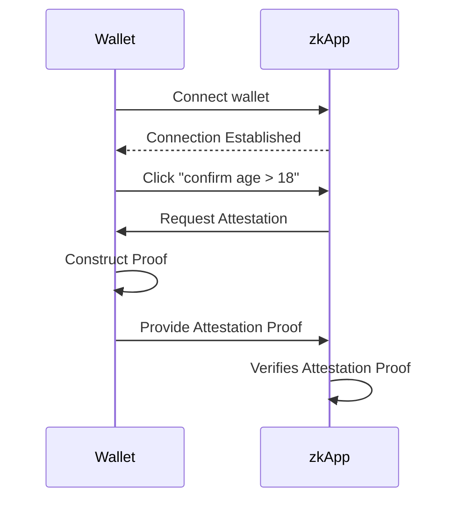

# RFC-0010: Wallet Provider Attestation API

- **Intent**: Introduces an extension to the wallet provider API that allows the wallet to perform private attestations.
- **Submitted by**: Theodore Pender (Github: @teddyjfpender, email: theodore.pender@minaprotocol.com, Twitter/X: @franklyteddy)
- **Submitted on**: Monday, January 15, 2024

## Abstract
This proposal introduces an extension to the wallet provider API for Mina wallets, focusing on enabling attestations beyond the current features of attesting to knowledge of private keys through RPC methods like `sign`. Mina's zk-native nature and client-side proving features sees the ecosystem well suited to attest to knowledge of many types of private data beyond knowledge of private keys. This proposal aims to expand this feature, allowing wallets to attest to a broader range of private data, such as credentials and zkOracle proofs. The concept of composable privacy is central to this extension, offering users and developers the discretion to select which data remains private and which becomes public. This ensures that sensitive data is not exposed to the browser context, remaining in the wallet, thereby upholding the privacy and security of users' private information. By empowering wallets to attest to private data within their contexts, this proposal brings to life a crucial aspect of composable privacy in the Mina ecosystem.

## Motivation
The motivation behind extending the Mina wallet provider API stems from the evolving needs of the Mina ecosystem's zkApp landscape. Currently there exists no standard for Mina wallets to interact with zkApps and attest to known private data. This limitation hinders the full potential of Mina's composable privacy feature, which is vital for user autonomy and data security.

## Specification

### API
Wallets should have a provider API parallel to EIP-1193 but tailored for Mina. The goal of this API extension is to build on top of pre-existing standards. 

#### Key Features of the Proposed API

- **Agnosticity to Application Types**: Whether an application operates on-chain, off-chain, or a combination of the two, this API remains consistent and reliable. 

- **Explicit User Control**: In a Mina-enabled DOM environment, the user is always in the driver's seat. The protocol is designed such that:
    - **User Consent for Attestation**: Explicit user approval is mandatory before the wallet can attest to any statement.

#### Primary Functionalities:
The proposed API should empower a Mina wallet to:
- **Request Attestation**: Initiate requests to receive an attestation proof of a claim.

### Scenario: Requesting Attestation From a Wallet
#### `mina_requestAttestation`
In the decentralized digital ecosystem, trust is established through verifiable attestations. Attestation, at its core, is an authoritative witness to the authenticity and validity of a piece of information or claim. 

Within the Mina-aware DOM settings, providers grant applications access to the `mina_requestAttestation` method, designed specifically for attestation scenarios. It caters to situations where zkApps desire attestations rooted in provable programs. The objective is to equip the wallet with the capability of attesting to specifics such as credentials or other known data. This is achieved without revealing the actual credential, ensuring privacy yet allowing for essential proofs, both for on-chain and off-chain scenarios.

Consider an example where a wallet reveals a credential's proof field to the browser for a transaction specific to a smart contract method. Here, it's anticipated that the wallet possesses a pertinent credential. However, if the wallet recognizes the credential but must attest to properties of the credential or other known data required by the zkApp, it must locally run a provable program to produce this proof. Furthermore, attestation is not limited in any scenario to making provable statements about a single provable data blob but also about multiple provable data blobs; consider the example when a wallet user must attest to owning KYC credentials from multiple global regions to create a single proof usable in a KYC-transaction. The provision for attestation extends beyond just transaction signing; it encapsulates the nuances of provable program inputs and their execution. This versatility serves on-chain and off-chain requirements, akin to verifiable presentations, but also demands caution. For instance, using private keys as public input for provable programs is highly discouraged, ensuring their use is strictly reserved for signatures and related operations.

To facilitate this interaction, the params field is vital, acting as the communication bridge between the requester and the wallet. It elucidates expectations, detailing the provable programs to be executed and the necessary attestations. The following pseudocode captures this flow succinctly:
```
// Pseudocode
START interaction
IF provider is defined
    REQUEST[1] attestation
    IF user approves
        RESOLVE[2] attestation
        CONTINUE zkProvableProgram
    IF user rejects
        REJECT[3] attestation
        STOP interaction
IF provider is undefined
    STOP interaction
```

[1] REQUEST
The requester MUST request attestation by calling the `mina_requestAttestation` RPC method on the provider exposed at `window.mina`. Calling this method MUST trigger a user interface allowing the user to approve or reject the attestation request. This method MUST return a Promise that is resolved with the desired proof or rejected if the attestation cannot be produced.

[2] RESOLVE
The Promise returned when calling the `mina_requestAttestation` RPC method MUST be resolved with the desired proof. This should emit an event message indicating that the attestation request has been approved and the promise has been resolved with the desired proof.

[3] REJECT
The Promise returned when calling the `mina_requestAttestation` RPC method MUST be rejected with an informative `Error` if the attestation cannot be produced. This should emit an event message indicating that the attestation request has been denied, and the promise is rejected with an error.

When a requester seeks attestation from a wallet, they must provide contextual bindings. These bindings are key-value pairs where the keys are strings, and the values can be any type with valid JSON encoding.

#### `mina_requestAttestation` Binding Parameters

#### `program`
A unique identifier or hash representing the provable program the wallet should run internally for attestation. This might correspond to the verification key of the provable program or its hash.

### `clientData`
An adaptable data structure designed to bind the wallet to contextually relevant information. The content and structure of `clientData` are dynamic, tailored to the specific scenario or attestation requirement at hand. It can encapsulate a range of data, from verifiable credentials to custom datasets, based on what the wallet is expected to know when attesting. Given the myriad potential use cases, the shape and constituents of clientData can vary widely. Requesters should structure it based on prior knowledge of the data the wallet is acquainted with, ensuring effective communication and validation during the attestation process.

#### `publicInputs`
A key-value map detailing the provable-program's method signature for open inputs. Each key-value pair describes a specific input and the value to use in the provable-program; further binding the wallet.


#### Example On-Chain Usage -- request attestation using a provable program for royalties claim
```ts
import { Mina } from "o1js";

const mina = window.mina;

try {
    // Define the binding for the attestation
    const binding = {
        // The program could be constrained by a unique identifier for the program like a verification key
        program: "ProvableProgramForRoyaltyClaim",
        clientData: {
            "type": ["VerifiableCredential", "ArtOwnershipCredential"],
            "credentialData": {
                "issuer": "did:mina:B62sj...owg",
                "credentialSubject": {
                    "id": "did:mina:B62rf...kf9",
                }
            }
        },
        // Define the required public inputs
        publicInputs: {
            "claim": {
                "property": "credentialData.credentialSubject.royaltyPercentage",
                "operation": "eq",
                "value": "5"
            },
            "nonce": {
                "value": "1"
            }
        },
    };

    // Request attestation using the binding. Wallet will match and verify internally against stored credentials.
    const attestationProof = await mina.request({
        method: 'mina_requestAttestation',
        params: binding
    });

    // Construct a transaction using the received attestation proof
    let transaction = await Mina.transaction(() => {
        new RoyaltiesZkApp(zkappAddress).claim(attestationProof);
    });

    // Prove the transaction
    await transaction.prove().catch(err => {
        throw new Error(`Proof generation failed: ${err.message}`);
    });

    // Request the Mina wallet to sign the transaction
    await mina.request({ method: 'mina_signTransaction', params: transaction });

    // Send the transaction to the Mina network
    mina.send('mina_sendTransaction', transaction);

    console.log("Royalty claim transaction sent!");

} catch (error) {
    if (error.message.includes('User denied')) {
        console.error("User denied the attestation request.");
    } else {
        console.error(`Error while claiming royalties: ${error.message}`);
    }
}
```

### Example Off-Chain Usage -- Request attestation using a provable program for game session keys
```ts
import { Mina } from "o1js";

const mina = window.mina;

try {
    // Define the binding for the attestation
    const binding = {
        program: "ProvableProgramForGameSessionKeys",
        clientData: {
            "type": ["VerifiableCredential", "GamerCredential"],
            "credentialData": {
                "issuer": "did:mina:B62gamerPlatform...owg",
                "credentialSubject": {
                    "id": "did:mina:B62player...kf9",
                    "gameProfile": "Player123"
                }
            }
        },
        // Define the required public inputs
        publicInputs: {
            "claim": {
                "property": "credentialData.credentialSubject.gameProfile",
                "operation": "eq",
                "value": "Player123"
            },
            "sessionKey": {
                "publicKey": "B62gis...jud"
            },
            "nonce": {
                "value": "3"
            }
        },
    };

    // Request attestation using the binding. Wallet will match and verify internally against stored credentials.
    const attestationProof = await mina.request({
        method: 'mina_requestAttestation',
        params: binding
    });

    // Use the attestation proof to initiate a game session
    const gameSession = GameAPI.initiateSession({
        playerProfile: "Player123",
        attestation: attestationProof
    });

    if (gameSession.status === "success") {
        console.log("Game session initiated successfully!");
    } else {
        console.error("Failed to initiate game session.");
    }

} catch (error) {
    if (error.message.includes('User denied')) {
        console.error("User denied the attestation request.");
    } else {
        console.error(`Error while initiating game session: ${error.message}`);
    }
}
```

## User Journey 

In this example user journey, an `Wallet` attests that they know some private data (e.g. a credential stating the user is over 18) that satisfies some constraints as defined by a specific zk-program and provides this attestation to a `zkApp`.

For further understanding, consider the sequence diagram below, which outlines the user journey:



**Note: All interactions with the zkApp are done client-side**

## Backwards Compatibility

As an extension to the existing Mina provider, this API does not affect the operation of existing APIs.

## Security Considerations

The process of attesting to data in the Mina ecosystem, as detailed in this proposal, introduces several security implications that must be carefully considered by implementors. The issues and mitigations outlined here are suggestions for implementors to consider.

### Unauthorized Attestation

#### Issue
If an attacker gains unauthorized access to a user's wallet, they could produce attestations on-behalf of the user.

#### Mitigation
- **Encryption**: Ensure that all private data are encrypted at rest.
- **Limited Lifetime**: Implementations could consider a mechanism where objects have a limited validity period, reducing the impact of potential breaches.

### Replay Attacks

#### Issue
If a user produces an attestation (i.e. a proof object) that proof, if provided to another party can be used in any other zk-program or smart contract method that can verify the proof.

#### Mitigation
- **Limited Lifetime**: Implementations could consider a mechanism where objects have a limited validity period, reducing the impact of potential breaches.
- **Unique Attestation Identifiers**: Include unique identifiers in each attestation. This ensures that each proof object is distinct and cannot be reused in different contexts.

