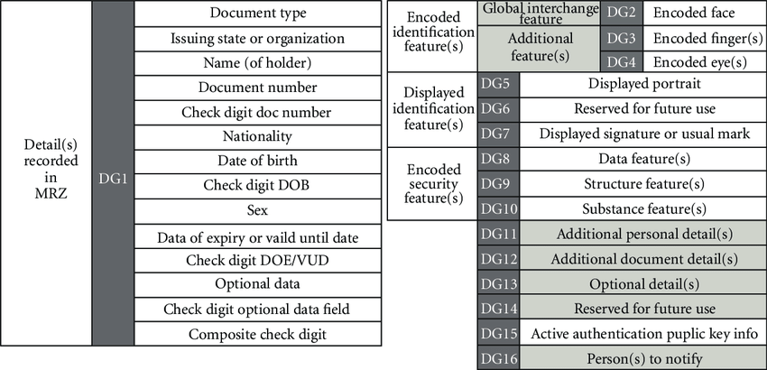

## RFP: ZKPassport

### Abstract

This proposal introduces a standard protocol for generating identity-related attestations from a Mina wallet. It aims to enhance the trust and integrity of digital identity systems by allowing users to prove the validity of their identity attributes without revealing the underlying data. This approach not only safeguards user privacy but also provides a robust framework for decentralized identity verification, making it applicable across various domains such as finance, healthcare, and online services. Through the implementation of ZKPassport, Mina wallet users can achieve higher levels of security and privacy in their digital interactions while ZKApps achieve a higher level of defense against sybil attacks and the ability to make their applications compliant with local laws.

### How will users provide the correct documents?

Most modern passports are Biometric passports or ePassports and contain a chip that can be scanned with NFC. These passports contain information regarding the passport such as country, age, date of birth, etc.

When scanned via a trusted mobile app, users can confidently produce a ZK Proof attesting to specific data on their passport chip. To gain a better understanding of which data can be accessed, please read the [ICAO specification](https://www.icao.int/publications/pages/publication.aspx?docnum=9303). Additionally, the public keys for checking the validity of this data can be found [here](https://download.pkd.icao.int/).

It's important to note that different issuer countries use different signature algorithms.

### What can be proven ?

All the following properties can be attested for with expection of any fingerprints, iris scans or any biometric data. Its even possible to attest for the passport photo.

### Specification

Generating a proof will involve multiple steps:

#### Register Circuit

The register circuit is used for the following:

- Verify the signature of the passport
- Verify that the public key which signed the passport is part of the registry Merkle tree (a check of the Merkle roots will be performed on-chain)
- Generate commitment = H (secret + passportData + some other data)

Once the proof is generated, the user can register on-chain and their commitment will be added to the Lean Merkle tree.

As the hash function and signature algorithm differ upon the issuer country, there will be a need for a single circuit which must support many different fucntions or sperate circuits per country. However one verifier for each register circuit will be deployed on-chain, all of them committing to the same Merkle tree.

##### Storing the Merkle Tree Using Offchain Storage

To ensure the Merkle tree containing key-value pairs of users' public keys and commitments is publicly accessible, we must maintain the following:

1. Very high uptime
2. Free read/write access
3. Decentralization to ensure trustlessness and resilience

We can achieve this using [Mina's Offchain Storage API](https://docs.minaprotocol.com/zkapps/writing-a-zkapp/feature-overview/offchain-storage). Below is a solution utilizing this API to store and manage the Merkle tree.

### Disclose Circuit

The disclose circuit is used for the following:

- Verify that a user knows a secret, e.g., they can reconstruct one leaf of the Merkle tree (a check of the Merkle roots will be performed on-chain)
- Verify passport expiry
- Perform a range check over the age of the user
- Multiply the output by an input bitmap to allow the user to disclose only what they want to disclose
- Pack the final output

Any application that wants to use Proof of Passport can actually build its own disclose circuit.

### Circuit Specification

### Use Case Scenarios

### Residency Verification for Regional Services

| Aspect           | Description |
|------------------|-------------|
| **Description**  | A zkApp wants a user to prove they reside in a specific region to access local government services or region-specific content. |
| **Requirements** | An implementation of zkPassport in the Attestation API Standard. |
| **Expected Outcome** | Users can prove their residency without revealing their exact address or any other personal information. |
| **Impact Analysis** | This would facilitate the delivery of region-specific services like voting in local elections, accessing regional healthcare, or streaming region-locked content, while maintaining user privacy. |

The ZK Passport attestaion can also be combine with other sorts of proofs to create more complex attestations.